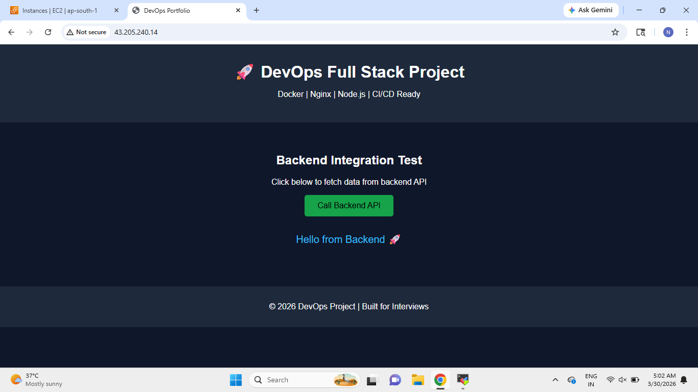
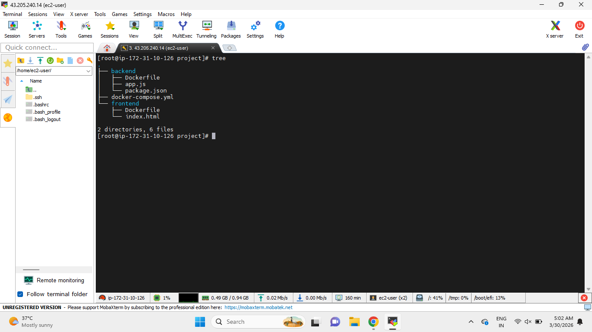

# 🚀 Docker Full Stack DevOps Project (Frontend + Backend + Docker Compose)

---

## 📌 Project Overview

This project demonstrates a **simple full-stack application using Docker** with separate frontend and backend services.

The application is containerized using **Docker** and runs using **Docker Compose**, simulating a real-world multi-container DevOps setup.

Whenever the application is started:

* Docker Compose builds both frontend and backend images
* Containers are created and run together
* Frontend communicates with backend using API calls

---

## 🧭 Application Architecture

```
User → Frontend (Nginx - Port 80) → Backend API (/api) → Backend (Node.js - Port 3000) → JSON Response
```

---

## ⚙️ Tech Stack

* HTML, CSS
* Node.js
* Express.js
* Nginx
* Docker
* Docker Compose

---

## 📂 Project Structure

```
docker-full-stack-project
│
├── backend
│   ├── Dockerfile
│   ├── app.js
│   └── package.json
│
├── frontend
│   ├── Dockerfile
│   └── index.html
│
├── docker-compose.yml
├── README.md
│
└── screenshots
    ├── application-deployed-successfully.png
    └── project-structure.png
```

---

## ⚙️ Application Components

### 1️⃣ Backend (Node.js API)

The backend is built using Express.js.

**Endpoints:**

* `/` → Health check
* `/api` → Returns JSON response

Example response:

```json
{
  "message": "Hello from Backend 🚀",
  "status": "success"
}
```

---

### 2️⃣ Frontend (Nginx)

* Static HTML page served using Nginx
* Button to call backend API
* Displays response dynamically

---

## 🐳 Docker Configuration

### Backend Dockerfile

* Uses Node.js base image
* Installs dependencies using `npm install`
* Runs application using `node app.js`
* Exposes port **3000**

---

### Frontend Dockerfile

* Uses Nginx base image
* Copies static HTML file to `/usr/share/nginx/html/`
* Exposes port **80**

---

## 🔁 Docker Compose Setup

Docker Compose is used to run multiple containers together.

### Services:

**Frontend Service**

* Build context: `./frontend`
* Port mapping: `80:80`

**Backend Service**

* Build context: `./backend`
* Port mapping: `3000:3000`

---

## ▶️ How to Run

```bash
# Clone repository
git clone https://github.com/nasiroddin-qatib/docker-full-stack-project.git

cd docker-full-stack-project

# Run containers
docker-compose up --build
```

---

## 🌐 Access Application

* Frontend → http://localhost
* Backend API → http://localhost:3000/api

---

## 📸 Project Screenshots

### Application Deployment Success



---

### Project Structure



---

## 🎯 What This Project Demonstrates

* Docker containerization
* Multi-container architecture using Docker Compose
* Frontend to backend API communication
* Nginx as a web server
* Basic DevOps project structure

---

## 👨‍💻 Author

Developed as part of hands-on practice to strengthen **Docker, DevOps, and full-stack application deployment concepts**.

---

## 📌 Final Summary

This project is a **Dockerized full-stack application** where frontend and backend run in separate containers and communicate through APIs using Docker networking.

---
